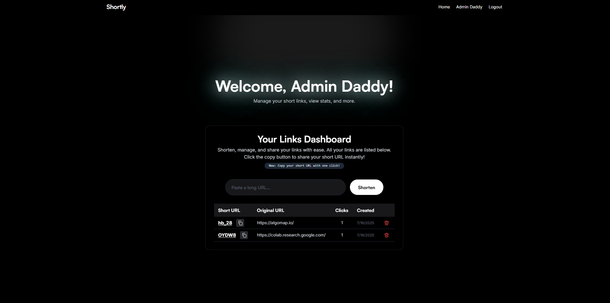

<p align="center">
  
</p>

<p align="center">
  <a href="https://github.com/rusilkoirala/shortly/actions"></a>
  <a href="./LICENSE"></a>
  <a href="https://github.com/rusilkoirala/shortly/pulls"></a>
  <a href="https://github.com/rusilkoirala/shortly/stargazers"></a>
  <a href="https://github.com/rusilkoirala/shortly/issues"></a>
</p>

# Shortly – MERN URL Shortener (Bitly Clone)

A modern, full-stack URL shortener built with the MERN stack. Instantly shorten long URLs, manage your links, and share them with a beautiful, minimal UI. Inspired by Bitly, but open source and privacy-friendly.

---



---

## 🚀 Tech Stack
- **MongoDB** – Database for users and links
- **Express.js** – REST API backend
- **React** – Frontend SPA
- **Node.js** – Server runtime
- **Tailwind CSS** – Modern, utility-first styling
- **nanoid** – Unique, secure short URL generation
- **JWT** – Secure authentication
- **React Router** – Client-side routing

---

## ✨ Features
- 🔗 **Shorten long URLs** with a single click
- 🔐 **User authentication** (register/login) with JWT
- 📋 **View all your created links** in a beautiful dashboard
- 📎 **Copy short URLs** with one click
- 🚀 **Redirect** instantly via short URL (e.g. `/abc12`)
- 🗑️ **Delete your own links** (only the owner can delete)
- 🛡️ **Secure routes** for user data and link management
- 🌑 **Dark mode** UI, fully responsive and minimal

---

## 🛠️ Getting Started

### Prerequisites
- Node.js (v18+ recommended)
- MongoDB (local or Atlas)

### 1. Clone the repository
```bash
git clone https://github.com/rusilkoirala/shortly.git
cd shortly
```

### 2. Backend Setup
```bash
cd backend
cp .env.example .env
# Edit .env with your MongoDB URI and JWT secret
npm install
npm run dev
```
- The backend runs on `http://localhost:5000` by default.

#### .env Example
See `backend/.env.example` for required environment variables:
```
MONGO_URI=mongodb://localhost:27017/shortly
JWT_SECRET=your_jwt_secret_here
PORT=5000
```

### 3. Frontend Setup
```bash
cd ../frontend
npm install
npm run dev
```
- The frontend runs on `http://localhost:5173` by default.

---

## 📚 API Endpoints

### Auth
- `POST   /api/auth/register` – Register a new user
- `POST   /api/auth/login` – Login and receive JWT
- `GET    /api/auth/profile` – Get current user profile (JWT required)
- `POST   /api/auth/logout` – Logout (clears cookie)

### Links
- `POST   /api/links` – Create a new short link (JWT required)
- `DELETE /api/links/:id` – Delete a link (JWT required, owner only)
- `GET    /api/info/:id` – Get info about a short link (JWT required)
- `GET    /:id` – Redirect to original URL

---

## 📁 Folder Structure
```
shortly/
  backend/
    config/           # DB config
    controllers/      # Route controllers (auth, link)
    middlewares/      # Auth middleware
    models/           # Mongoose models (User, Link)
    routes/           # Express routes
    utils/            # JWT helpers
    server.js         # Entry point
    .env.example      # Example environment variables
  frontend/
    src/
      api/            # Axios instance
      components/     # React components
      pages/          # Page components (Home, Login, Register, etc.)
      context/        # Auth context
      index.css       # Tailwind + custom styles
      App.jsx         # Main app
      main.jsx        # Entry point
    public/
    tailwind.config.js
    vite.config.js
```

---

## 🤝 Contributing

Contributions are welcome! To contribute:
1. Fork this repository
2. Create a new branch (`git checkout -b feature/your-feature`)
3. Commit your changes (`git commit -m 'Add some feature'`)
4. Push to the branch (`git push origin feature/your-feature`)
5. Open a Pull Request

Please open an issue first to discuss any major changes.

---

## 📄 License

This project is [MIT Licensed](./LICENSE). 
